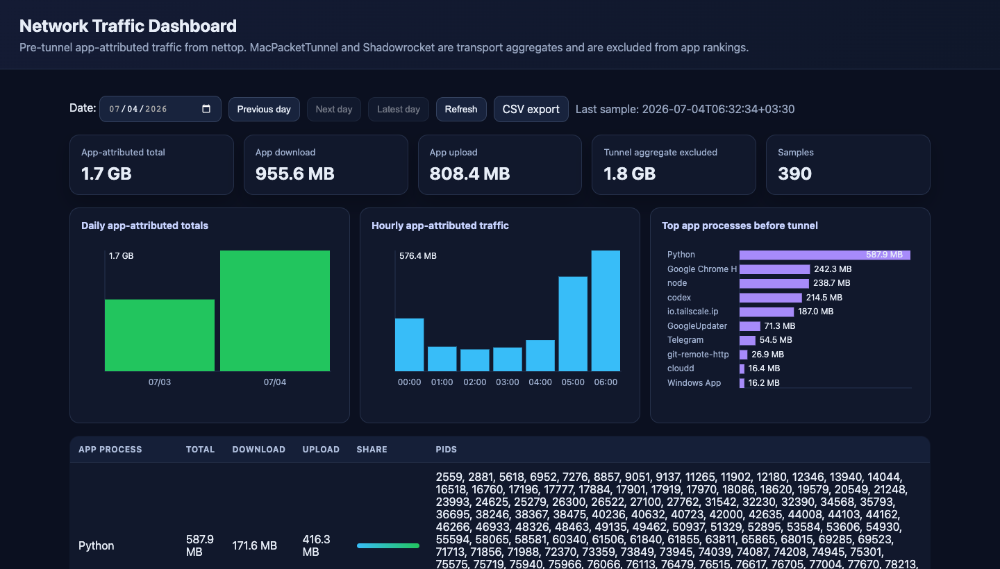

# Network Traffic Dashboard

A macOS-only, zero-runtime-dependency network traffic dashboard for figuring out which process is moving data when VPN clients such as Shadowrocket aggregate traffic under `MacPacketTunnel` in Activity Monitor.

The collector samples Apple's `nettop`, stores every sample in SQLite, and serves a local dashboard with daily, hourly, and per-process charts. The main dashboard view reports app-attributed traffic before the tunnel and keeps tunnel transport aggregates separate so `MacPacketTunnel` does not hide the real app ranking.

## Screenshot



## Features

- Low-CPU per-process traffic attribution using instant `nettop -P -x -L 1` counter snapshots by default; legacy continuous `nettop -P -x -d -L 2 -s <interval> -n` delta mode remains available when maximum short-lived-process fidelity is worth the CPU cost.
- SQLite database storage for every sample and every process delta.
- Daily app-attributed totals chart across all recorded days.
- Hourly app-attributed chart for the selected day.
- Top app-process chart and table for the selected day.
- Hover tooltips on charts showing total, download, and upload values.
- Compact PID samples: APIs and the table return `pid_count` plus a short recent PID sample instead of unbounded PID lists.
- Calendar-style date picker with previous/next/latest recorded-day navigation.
- High-contrast SVG favicon for quickly spotting the dashboard tab.
- Separate tunnel aggregate card for `MacPacketTunnel` / `Shadowrocket` transport volume.
- CSV export for each day.
- Optional PostgreSQL archive sync: keep today in local SQLite, read completed days from the archive, and prune synced completed days from local storage.
- macOS LaunchAgent installer for automatic background collection.
- No runtime Python packages beyond the standard library.

## Run manually

```bash
cd ~/Documents/NetworkTrafficDashboard
python3 network_usage_dashboard.py --serve 127.0.0.1:18686 --interval 60
```

The default `snapshot` collector keeps CPU low by taking quick cumulative
`nettop` snapshots every 5 seconds and computing deltas in Python, then writing
one database sample per `--interval`. If you need the older continuous nettop
delta sampler for maximum fidelity on very short-lived processes, use:

```bash
python3 network_usage_dashboard.py --serve 127.0.0.1:18686 --interval 60 --collector-mode delta
```

For lower or higher snapshot granularity:

```bash
python3 network_usage_dashboard.py --serve 127.0.0.1:18686 --interval 60 --snapshot-poll-interval 2
```

Open:

```text
http://127.0.0.1:18686/
```

## Data storage

Default data directory:

```text
~/Library/Application Support/NetworkTrafficDashboard
```

Default SQLite database:

```text
~/Library/Application Support/NetworkTrafficDashboard/network_traffic.sqlite3
```

The database stores:

- `samples`: one row per collector sample.
- `process_deltas`: one row per process observed in each sample.
- `errors`: collector errors, if any.
- `metadata`: schema version and future metadata.

By default all data stays in this local SQLite database. If optional archive sync
is configured, the dashboard keeps current-day data locally and treats completed
days as archive data:

- Today is read from local SQLite.
- Previous days are synced to PostgreSQL and read from PostgreSQL.
- After a completed day is verified in PostgreSQL, it is deleted from local
  SQLite and the local database is vacuumed to keep disk usage low.
- If no archive database is configured, nothing changes and all days remain
  local.

Archive sync uses the `psql` command-line client so the app can stay
dependency-free.

### Optional PostgreSQL archive sync

Set a PostgreSQL URL when running the dashboard:

```bash
NETWORK_TRAFFIC_SYNC_DATABASE_URL='postgresql://user@host:5432/database' \
NETWORK_TRAFFIC_SYNC_PSQL=/path/to/psql \
python3 network_usage_dashboard.py --serve 127.0.0.1:18686 --interval 60
```

Password options:

- Put credentials in `.pgpass`, a `pg_service.conf` setup, or the URL if that is
  acceptable for your machine.
- On macOS, store the password in Keychain and pass the service/account:

```bash
security add-generic-password -U \
  -s network-traffic-archive-db \
  -a user \
  -w 'your-postgres-password'

NETWORK_TRAFFIC_SYNC_DATABASE_URL='postgresql://user@host:5432/database' \
NETWORK_TRAFFIC_SYNC_KEYCHAIN_SERVICE=network-traffic-archive-db \
NETWORK_TRAFFIC_SYNC_KEYCHAIN_ACCOUNT=user \
python3 network_usage_dashboard.py --serve 127.0.0.1:18686 --interval 60
```

Prefer a passwordless PostgreSQL URL plus macOS Keychain variables. Do not put a
database password in LaunchAgent arguments or committed documentation.

Failed archive sync attempts are non-fatal and back off for 15 minutes by
default so collector sampling continues without spawning `psql` every interval.
Override with `NETWORK_TRAFFIC_SYNC_RETRY_INTERVAL_SECONDS` or
`--sync-retry-interval-seconds` when debugging.

Sync completed local days once and exit:

```bash
python3 network_usage_dashboard.py --sync-completed-days
```

Keep synced completed days locally instead of pruning them:

```bash
python3 network_usage_dashboard.py --no-sync-prune --serve
```

## Install as a macOS LaunchAgent

```bash
cd ~/Documents/NetworkTrafficDashboard
./install_network_dashboard_launch_agent.sh
```

Defaults:

- Dashboard: `http://127.0.0.1:18686/`
- Sample interval: `60` seconds
- Database: `~/Library/Application Support/NetworkTrafficDashboard/network_traffic.sqlite3`
- Service logs: `~/Library/Logs/NetworkTrafficDashboard/`

Override examples:

```bash
INTERVAL=30 BIND=127.0.0.1:18687 ./install_network_dashboard_launch_agent.sh
COLLECTOR_MODE=delta ./install_network_dashboard_launch_agent.sh
SNAPSHOT_POLL_INTERVAL=2 ./install_network_dashboard_launch_agent.sh
```

Enable optional archive sync in the LaunchAgent:

```bash
SYNC_DB_URL='postgresql://user@host:5432/database' \
SYNC_PSQL=/path/to/psql \
SYNC_KEYCHAIN_SERVICE=network-traffic-archive-db \
SYNC_KEYCHAIN_ACCOUNT=user \
./install_network_dashboard_launch_agent.sh
```

## Uninstall LaunchAgent

```bash
cd ~/Documents/NetworkTrafficDashboard
./uninstall_network_dashboard_launch_agent.sh
```

Collected database files are kept.

## CLI reports

Initialize the database:

```bash
python3 network_usage_dashboard.py --init-db
```

Take one sample and save it:

```bash
python3 network_usage_dashboard.py --collect-once --interval 3
```

Show reports:

```bash
python3 network_usage_dashboard.py --report
python3 network_usage_dashboard.py --days
```

CSV export is available from the dashboard:

```text
/api/export.csv?date=YYYY-MM-DD
```

By default CSV exports app-attributed rows only. Add `include_tunnels=1` when you
also need the separate tunnel aggregate rows:

```text
/api/export.csv?date=YYYY-MM-DD&include_tunnels=1
```

## Local API

- `GET /health`
- `GET /api/today?top=40&pids=8`
- `GET /api/day?date=YYYY-MM-DD&top=40&pids=8`
- `GET /api/days`
- `GET /api/timeseries?date=YYYY-MM-DD`
- `GET /api/export.csv?date=YYYY-MM-DD&include_tunnels=1&pids=8`

`top` caps process rows returned by summary APIs and `pids` caps the recent PID
sample per process. Every process row still includes `pid_count` so long-running
respawning processes remain visible without bloating the UI or JSON payload.
Invalid `date` values return HTTP 400.

When archive sync is configured, these APIs automatically read current-day data
from SQLite and completed-day data from PostgreSQL.

## Development

```bash
cd ~/Documents/NetworkTrafficDashboard
python3 -m pip install -r requirements-dev.txt
python3 -m py_compile network_usage_dashboard.py tests/test_network_usage_dashboard.py
python3 -m pytest -q
```

## Notes

`MacPacketTunnel` and `Shadowrocket` rows are aggregate tunnel transport usage, not the real app ranking. The dashboard excludes those tunnel rows from main totals, charts, tables, and CLI reports by default, then shows the excluded tunnel volume separately. Other rows such as `Chrome`, `node`, `Python`, `Telegram`, or `Tailscale` identify processes macOS can still attribute before traffic enters the tunnel. Attribution is useful, but not perfect: traffic that macOS only exposes as packet-tunnel transport cannot be reassigned to an original app without deeper privileged packet/flow instrumentation.

HTTP access logging is disabled by default to avoid noisy LaunchAgent logs during
normal dashboard polling. Set `NETWORK_TRAFFIC_ACCESS_LOG=1` when request-level
debugging is needed.
